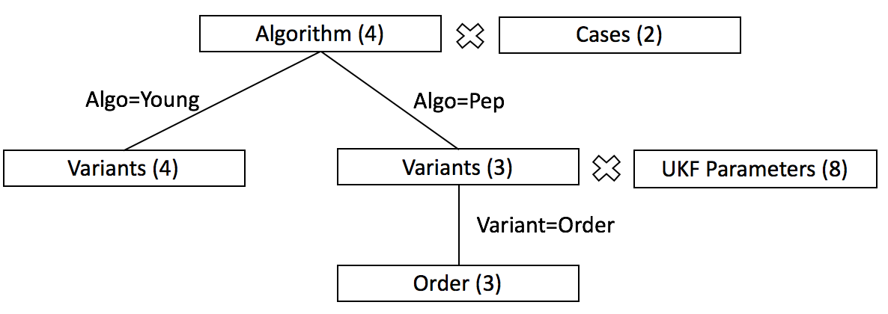

# nested_list_product
The product (or in other terms the combination) of multiple lists generates all the combination of list elements equivalent to the elements of a tensor. In algorithm testing or in other experimental settings we need to generate products with nested lists. This is a small code in MATLAB and Python.

Differently from combivec (MATLAB) and itertools.product (Python) this supports non-uniform grid, that is for some combinations it provides sub-lists to be explored.

In Python sklearn the [sklearn.model_selection.ParameterGrid](http://scikit-learn.org/stable/modules/generated/sklearn.model_selection.ParameterGrid.html#sklearn.model_selection.ParameterGrid) provides a uniform not hierarchical listing.

## Case Study: Paper on Inertial Measure Review on Sensors:

This is an example of problem found in a paper we are publishing:

- Algorithms: zhu, yun, young, pep, peps
- Variants: 
  - Young: pure or perfect
  - Peppoloni: original or svd or reordered
  - ...  
- Case:
  - Real Case: Aug10
  - Simulation

As it can be seen the Algorithm pep has different variants than Algorithm pep. Algorithm peb has a Variant "reordered" with three different values, and it could have also some UKF parameters as in the following figure:



# Context "Disciplined Multi-Algorithm Testing"
The aim is to run multiple algorithms and their variants and keep track of all the outcomes for comparison. We identify the following concepts:

- Case: one of the possible data input situations
- SubCase: some decomposition of the case, associated with some Case Parameters
- Algorithm: the name of the algorithm
- Variant: a major variant of the algorithm (exclusive)
- Algorithm Parameter: an enumeration or numeric argument for the given Algorithm or Variant
- Algorithm Instance: combines Algorithm+Variant+Parameters 
- Unique Identifier: unique identification of Algorithm Instance that should be compatible with a given naming scheme (e.g. Matlab structure variable)
- Reference: the reference value of the given Case/SubCase, that will be compared against algorithm result by means of metrics
- Measure: performance measure of the case given the execution of the Algorithm with unit of measure
- Repetition: repetition index of the Case by AlgorithmInstance in case the Algorithm has some random aspect

The idea is to execute all the Cases by AlgorithmInstances and build a single table. This table will have the following field (or field families):

# Approach

We model this with enumerations (e.g. list of algorithms), with the possibility of nested enumeration for a given value (e.g. list of variants for a given algorithm),
and finally parameters variations (e.g. for specific version). Also datasets are an enumeration.

We then generate a matrix M by N, where M is one of the enumeration at all levels, and N is the list of all possible cases. Each element of a row is the index of the values of the enumeration. If an enumeration is not applicable the index is 0 (Matlab), -1 (Python).

For example: we have a three level case
- dataset: aug sim
- model: zhu pep young
- model=young versions: pure, perfect
- model=pep versions: original, svd, reorder
- model=pep version=reorder orders: 1 2 3

We obtain the following matrix: 5x16 and the corresponding list of the enumerations

```
     1     2     1     2     1     2     1     2     1     2     1     2     1     2     1     2
     1     1     3     3     3     3     2     2     2     2     2     2     2     2     2     2
   NaN   NaN     1     1     2     2   NaN   NaN   NaN   NaN   NaN   NaN   NaN   NaN   NaN   NaN
   NaN   NaN   NaN   NaN   NaN   NaN     1     1     2     2     3     3     3     3     3     3
   NaN   NaN   NaN   NaN   NaN   NaN   NaN   NaN   NaN   NaN     1     1     2     2     3     3
```
All enumerations names:

```
                              dataset: 1
                                model: 2
                 model_young__version: 3
                   model_pep__version: 4
    model_pep__version_reorder__order: 5
```

The first two columns correspond to the model zhu and the two datasets. Then we have the two datasets by the two variants of young, finally the pep model with two others nesting levels (version and order). 


# TODO

Python is based on itertools.product and numpy to provide a matrix structure similar to the one in Matlab. There are some transformations back and forth lists and it would be interesting to have a matrix version of itertools.product similar to combivec of Matlab.


